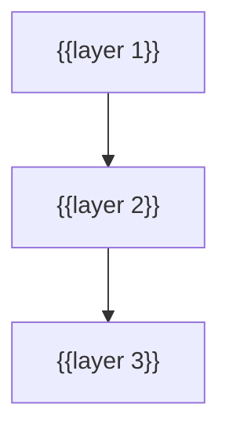

# {{PROJECT_NAME}} Architecture

A map of how {{PROJECT_NAME}} fits together. Start here before you change anything. Every path below exists in the repo.

> Related: [onboarding.md](onboarding.md) · [testing.md](testing.md) · [glossary.md](glossary.md) · [adr/](adr/)

## 1. System context

<!-- GUIDE: Mermaid flowchart of clients, processes, datastores and external services. Label the nodes with real folders. -->
```mermaid
flowchart LR
    U[{{Client}}] --> A[{{Component}}<br/>{{folder}}/]
    A --> DB[({{Datastore}})]
```

<!-- OPTIONAL: dev vs prod table -->
| Mode | {{Component A}} | {{Component B}} |
|------|------|------|
| Development | {{command, port}} | {{command, port}} |
| Production | {{how it is served}} | {{how it is served}} |

The entry point is `{{entry file}}`. {{What startup does: DB init, migrations, scheduler, router mounting}}.

## 2. Layers

<!-- GUIDE: Mermaid diagram of the internal layers, then a table. Use real base classes. -->


| Layer | Where | Key files |
|-------|-------|-----------|
| {{Layer}} | `{{path}}` | `{{file}}` (`{{Symbol}}`) |

### Worked trace: `{{ONE REAL REQUEST OR FLOW, e.g. GET /api/items/{id}}}`

<!-- GUIDE: REQUIRED. Read the code and follow one real request end to end. One numbered step per hop, with file paths and symbols. This is the most valuable part of the doc. -->
1. **{{Hop}}.** `{{file}}`: {{what happens}}

To trace other features the same way, use `/trace <feature>`.

<!-- OPTIONAL sections. Include each one that applies, numbered in order: -->
## 3. {{Cross-cutting concern: auth / multi-tenancy / permissions}}

## 4. {{Code generation / source of truth}}
<!-- table: generator → output; state "never edit by hand" and name the hook that enforces it -->

## 5. {{Background work, events, queues}}

## 6. {{Other notable services / integrations}}

## {{N}}. Where do I find…

| I want to… | Look in |
|------------|---------|
| {{Add an endpoint / page / job / setting / migration}} | `{{path}}`, then `{{command}}` |
| Change CI | `{{.github/workflows/…}}` |
